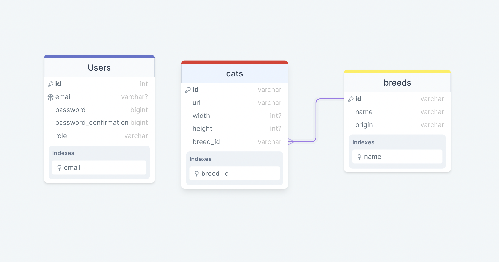

# Cats App

> Cats App is a web application that allows you to see your favorite cats and its breed and and filtered them by breed
# ERD (Entity Relationship Diagram)
- Cats App follows this diagram for creating migration files and database


Additional description of the project and its features.

## Built With

- RUBY (3.1.2)
- RUBY ON RAILS 7
- Devise
- Cancancan
- Pagy
- RestClient

## Live demo
- [Live link demo](https://rails-cat-app.herokuapp.com/)
## Gems Used

- Rubocop
- RAILS (v7)

## How to Setup

> You can simply clone or download [this repository](https://github.com/youmari/CatsApp.git), and use your favorite browser or code editor to run this program.

- To open this project using vs code ( for this example) or your favorite code editor, you can follow the guide below:
  > in your cmd or command line navigate to where this project is located, then:

```bash
cd CatsApp
```

> thereafter run

```bash
code .
```

## How to Run the App through the terminal

- To run the application through the terminal, make sure ruby and rails are installed on your computer then follow the guide below:
  > in your cmd or command line navigate to where this project is located, then;

```cmd
cd CatsApp
```

## Install Gems


```bash
bundle install
```

> thereafter run the below command to start the server on localhost

```bash
rails s 
```
## Set up database
> to create databases on your local machine follow the steps below :
1. First make sure that PostgreSQL installed on your machine
2. make sure that the PostgreSQL server is running 
3. run the following command to create the database on your machine
  ```bash
  rake db:create
  ```
  ### Update schema file and database
  - To run the migration files to update schema and database simply run the following command :
  ```bash
  rails db:migrate
  ```
  ### Seed the database with cats and breeds
  - after running the migrations command run the following to seed the database:

  ```bash
  rails db:seed
  ```
## Author

👤 **Youmari**

- GitHub: [@youmari](https://github.com/youmari)
- Twitter: [@yf_omari](https://twitter.com/yf_omari)
- LinkedIn: [LinkedIn](https://www.linkedin.com/in/yassine-omari-945114190/)

## 🤝 Contributing

Contributions, issues, and feature requests are welcome!

Feel free to check the [issues page](../../issues/).

## Acknowledgments

- Special thanks to [OddCamp](https://www.oddcamp.com)

## Show your support

Give a ⭐️ if you like this project!


## 📝 License

This project is Public feel free to use it.
